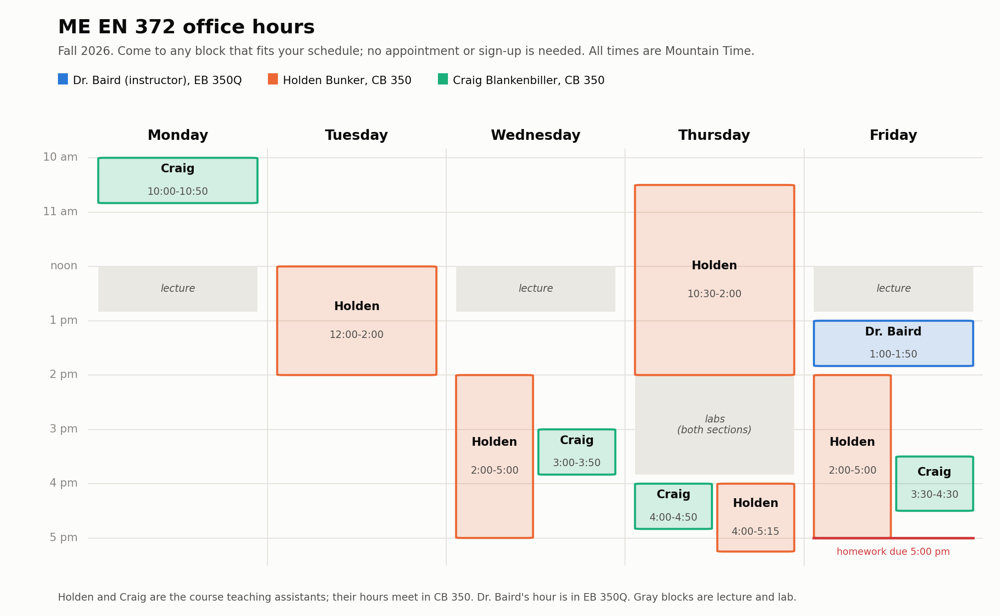

<!-- Generated by scripts/build_student_course_info.py in the course repository on Thursday, September 10, 2026. Do not edit: the next sync overwrites it. -->

# Office hours

The live page, which is the authority if this copy is ever behind: <https://byu.instructure.com/courses/36965/pages/office-hours>. Every block is also on the Canvas calendar.

Come to any block that fits your schedule; no appointment or sign-up is
needed. All times are Mountain Time.

Dr. Baird (the instructor) also meets by appointment: to set up a time,
send a message via Canvas Inbox (preferred) or email
[sterling.baird@byu.edu](mailto:sterling.baird@byu.edu).

- **Monday:** Craig, 10:00 to 10:50 am
- **Tuesday:** Holden, 12:00 to 2:00 pm
- **Wednesday:** Holden, 2:00 to 5:00 pm; Craig, 3:00 to 3:50 pm
- **Thursday:** Holden, 10:30 am to 2:00 pm; after lab, Holden, 4:00 to 5:15 pm, and Craig, 4:00 to 4:50 pm
- **Friday:** Dr. Baird, 1:00 to 1:50 pm; Holden, 2:00 to 5:00 pm; Craig, 3:30 to 4:30 pm. Homework is due at 5:00 pm, and Friday help runs right up to the deadline.

Every block is also on the course calendar in Canvas, so upcoming hours
appear in your Canvas calendar and in the Course Summary at the bottom of
the syllabus. The hours run through Thursday, December 10, 2026, the last
day of classes, with no hours November 25 to 27 (Thanksgiving break).

Holden Bunker and Craig Blankenbiller are the course teaching assistants.
Locations for these hours will be posted on the Canvas page once rooms are confirmed.
